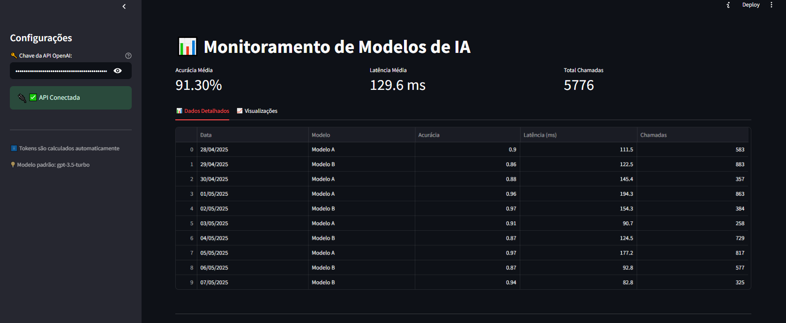

# Monitoramento de Modelos de IA com Assistente Generativo

Este projeto é um **protótipo interativo de dashboard em Streamlit** para monitoramento de modelos de Inteligência Artificial (IA), com métricas simuladas e um **chatbot com IA generativa integrado** usando a API da OpenAI.

>  **Este foi meu primeiro projeto utilizando Streamlit e integração com IA generativa.**

---

##  Objetivo do Desafio

- Criar uma **interface simples e funcional em Streamlit** para exibir métricas de desempenho de modelos de IA.
- Incluir **visualizações gráficas** dos dados para facilitar o acompanhamento.
- Adicionar um **chatbot com suporte técnico via IA** (usando GPT-3.5 da OpenAI).
- Aplicar boas práticas como separação de seções, estado da aplicação e tratamento de erros.

---

## 🛠️ Tecnologias Utilizadas

- Python 3.11
- [Streamlit](https://streamlit.io/)
- [OpenAI Python SDK](https://pypi.org/project/openai/)
- Pandas
- Ambiente virtual (`venv`) com configuração segura
- Modo escuro da interface do usuário

---

## 📌 Funcionalidades

### 🧮 Dashboard de Monitoramento

- Geração automática de métricas simuladas dos modelos (Acurácia, Latência e Chamadas).
- Exibição de tabela e gráfico de linha com desempenho diário.
- Cálculo de **médias e totais** das métricas.
- Atualização em tempo real com data e hora atual.

### 🤖 Chatbot IA (GPT-3.5)

- Input de texto do usuário via `st.chat_input()`.
- Histórico de conversas usando `st.session_state`.
- Mensagens do assistente são geradas com base no histórico completo.
- Contador de **tokens utilizados** e estimativa de custo exibidos na sidebar.
- Personalização do comportamento do assistente via `system prompt`.

### 🔐 Segurança e Controle

- Leitura da chave da API OpenAI via campo de senha. (Optei por não usar "import os
openai_api_key = os.getenv("OPENAI_API_KEY")")

- Mensagens de status para informar se a API está conectada.
- Tratamento de erros de API, limite de tokens e chave inválida.
- Salvar histórico em CSV/JSON (opcional, mas não criei.)

`pd.DataFrame(st.session_state.historico).to_csv("chat_log.csv", index=False)`

---

## 🧪 Exemplo Visual



---

## 💬 Primeira Experiência

> Este projeto representa **minha primeira experiência prática com Streamlit e integração com modelos de IA generativa**.  
Durante o desenvolvimento, aprendi sobre:
- Criação de interfaces reativas com Streamlit
- Gerenciamento de estado da aplicação
- Integração com APIs externas (OpenAI)
- Visualização de dados com Pandas e gráficos interativos

---

## 🚀 Como Executar

```bash
# 1. Clonar este repositório
git clone https://github.com/seu-usuario/Streamlit.git
cd Streamlit

# 2. Criar e ativar ambiente virtual
python -m venv .venv
.venv\Scripts\activate  # No Windows

# 3. Instalar dependências
pip install -r requirements.txt

# 4. Rodar aplicação
streamlit run monitoramento_ia.py
```

# To-Do Futuro

- Conectar com base de dados real (PostgreSQL ou BigQuery)

- Adicionar autenticação de usuário

- Incluir múltiplos modelos e comparação de performance

- Exportar relatórios em PDF

